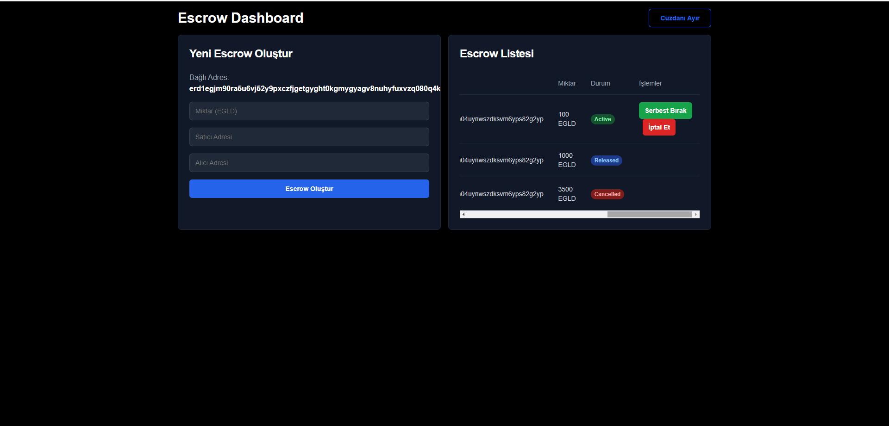

# Token Escrow Full Stack Dapp

**Token Escrow Full Stack Dapp** is a decentralized application (DApp) designed to enable secure and trustless token exchanges on the MultiversX blockchain. This application leverages a robust smart contract to facilitate peer-to-peer (P2P) transactions without intermediaries. Users can create, accept, and cancel trade offers, ensuring the security of asset transfers.

---

### Token Escrow Smart Contract Features
- **Create Offer**: Users deposit tokens and define conditions for release (including recipient and exchange terms).
- **Cancel Offer**: Users can cancel an offer and recover their deposited tokens if the offer has not been accepted.
- **Accept Offer**: Recipients can meet the terms, complete the trade, and claim the tokens.
- **View Offers**: Retrieve pending trade offers created by or targeted at a specific user.

### Smart Contract Functions
- `createOffer`: Stores the offer on the blockchain and locks the tokens in escrow.
- `cancelOffer`: Cancels the specified offer and returns the locked tokens to the creator.
- `acceptOffer`: Completes the trade and transfers assets to both parties.
- `getOffers`: Retrieves all open offers for a given user.

### User Interface (UI)
- **Wallet Integration**: Seamless connection with MultiversX-compatible wallets.
- **Offer Management**: Create, view, and cancel trade offers.
- **Trade Dashboard**: Display open offers and transaction history.
- **Notifications**: Receive updates on trade activities (e.g., offer acceptance or cancellation).
- **Security Checks**: Ensure users confirm actions (e.g., creating or accepting an offer).

### MultiversX Testnet Deployment
The DApp has been deployed and tested on the MultiversX Testnet to ensure all functionalities work as expected:
- Locking and releasing funds.
- Offer cancellation and trade completion.

---

### Requirements
- [Node.js](https://nodejs.org/) (v14 or above)
- [MultiversX Wallet](https://wallet.multiversx.com/)
- A MultiversX Testnet account with test tokens

### Setup
1. Clone the repository:
   ```bash
   https://github.com/beyzanrkeskinnn/Blockchain_Education.git
   cd escrow-finalproject
   ```
2. Install dependencies:
   ```bash
   npm install
   ```
3. Compile the smart contract:
   ```bash
   npm run compile
   ```

### Deployment
1. Deploy the smart contract to the MultiversX Testnet:
   ```bash
   npm run deploy
   ```
2. Note the provided contract address after deployment.

---

### Running the DApp
1. Start the development server:
   ```bash
   npm run dev
   ```
2. Open your browser and navigate to `http://localhost:3000`.
3. Connect your MultiversX-compatible wallet.

---

